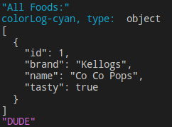

# My quick way to log to node console with some color

## Usage
```javascript
colorLog.black(thingToLog, moreThingsToLog);  

colorLog.red(thingToLog, moreThingsToLog);

colorLog.green(thingToLog, moreThingsToLog);

colorLog.yellow(thingToLog, moreThingsToLog);

colorLog.blue(thingToLog, moreThingsToLog);

colorLog.magenta(thingToLog, moreThingsToLog);

colorLog.cyan(thingToLog, moreThingsToLog);

colorLog.white(thingToLog, moreThingsToLog);

colorLog.gray(thingToLog, moreThingsToLog);
```

## Example
```javascrript
    colorLog.cyan('All Foods:', foods);
    colorLog.magenta('DUDE')
```
</img>
- If the item being logged is a function, object or symble, i prefer the format presented with regular logging, but still wanted an eye catching line.